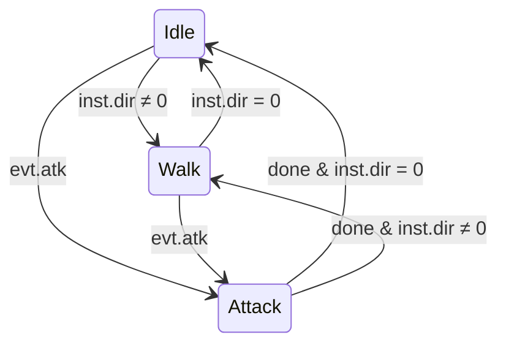

## Player FSM

```mermaid
stateDiagram-v2

Idle --> Walk: inst.dir ≠ 0
Walk --> Idle: inst.dir = 0
Idle --> Attack: evt.atk
Walk --> Attack: evt.atk
Attack --> Idle: done & inst.dir = 0
Attack --> Walk: done & inst.dir ≠ 0
```

## Z-index

ground(tile): -1
props: 1
player: 1
enemy: 1
npc: 1
